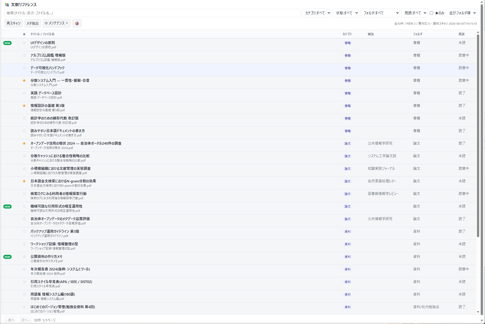
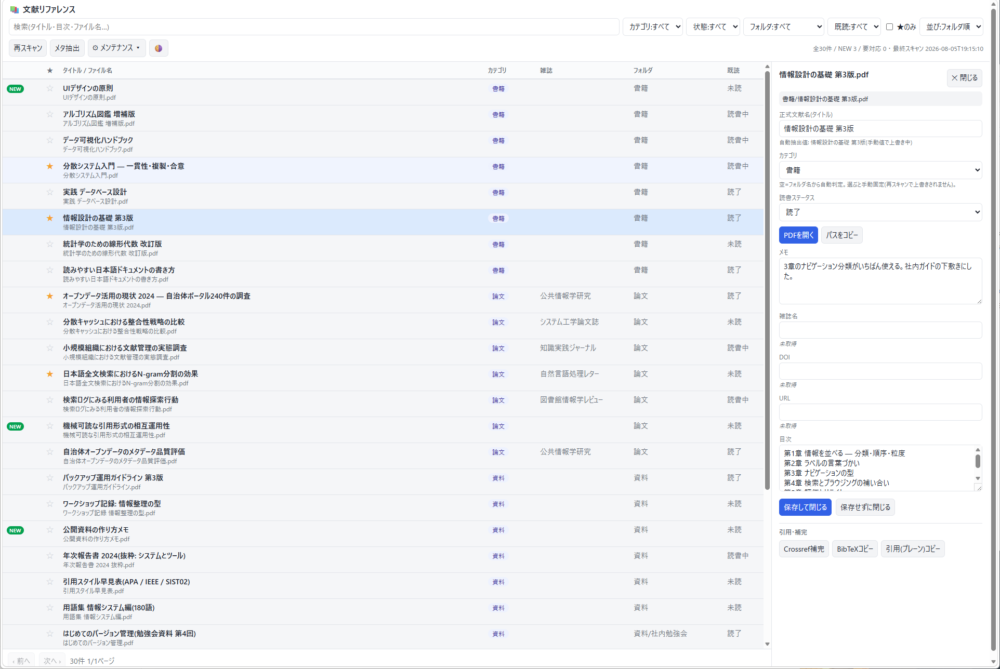

# 文献リファレンスツール(reftool)

手元の PDF / PPT / PPTX を**1ファイルも移動せずに**、一覧・検索・整理するためのシングルユーザー向けWebアプリです。フォルダに置いたままの資料に、正式なタイトル・雑誌名・DOI・カテゴリ・目次・メモ・お気に入りを付けて、日本語の全文検索で引けるようにします。



- **ファイルに触りません**: 移動・リネーム・削除・上書きを一切しません。場所を記録して一覧にするだけです
- **ローカル完結**: 付けた情報はすべて自分のPCの中(`library.db` 1ファイル)。外に出るのはDOI補完のときだけで、設定で切れます
- **日本語で全文検索**: SQLite FTS5 trigram。タイトル・雑誌名・メモ・目次・ファイル名をまとめて引けます
- **動かしても迷子になりません**: 内容ハッシュで移動を検出し、付けた情報をワンクリックで引き継げます
- **スマホ対応**: Tailscale を入れれば、手元の端末から蔵書を検索できます(任意)
- **依存は4つだけ**: fastapi / uvicorn / pypdf / python-pptx。PDFを読むのに外部プログラムは要りません

## 必要環境

- **Python 3.11 以上**(推奨 3.12 以降)。ほかに用意するものはありません
- Windows / macOS / Linux で同じものが動きます(macOS 26.5.1 / Apple Silicon で実機確認済み)

> ⚠️ **macOS に最初から入っている Python は 3.9 で足りません。** `python3 -V` で確認し、足りなければ
> [python.org](https://www.python.org/downloads/) から入れるか `brew install python` してください。
> 最初から入っている 3.9 は `/usr/bin/python3` に残るので、他のソフトへの影響はありません。

依存パッケージは初回起動時に自動で入ります(仮想環境 `.venv` を勝手に作るので、システムのPythonは汚しません)。

## 入手方法

**ZIP で入れる**(git 不要)

1. このページの右上にある緑色の **「Code」** ボタン → メニューのいちばん下の **「Download ZIP」**
2. ダウンロードした ZIP を展開する
3. できたフォルダの名前を **`_reftool`** に変える(展開直後は `reftool-main` のような名前です)

**git で入れる**(更新を受け取りやすい)。末尾の `_reftool` を忘れないでください。

```bash
git clone https://github.com/m-higashi/reftool.git _reftool
```

新しい版に入れ替えるときは `git pull`、または ZIP を展開して中身だけを上書きします。
`library.db` / `backups/` / `.venv` は更新の対象外なので、**付けた情報は消えません**。

```bash
rsync -a 展開したフォルダ/ 置いた場所/_reftool/
```

# 設置と起動

## 置き場所(ここだけ間違えると動きません)

**フォルダ名は必ず `_reftool`** にして(先頭のアンダースコアも必要です)、**管理したい資料が入っているフォルダの直下**に置きます。

```
文献/                      ← このフォルダ以下が読み取り対象
  ├ _reftool/             ← ここに置く
  ├ 書籍/
  ├ 論文/
  │   └ 2024/             ← 何段でも自由
  └ 雑誌/
      ├ ○○誌 2024年1月号.pdf
      └ ○○誌 2024年2月号.pdf
```

- 親フォルダの名前は何でもかまいません(この文書では例として「文献」と書きます)
- `_reftool` の中に資料を置かないでください(読み取り対象外です)
- 場所を変えたくなったら、**親フォルダごと**動かしてください。`_reftool` だけ動かすと全件が「欠落」になります

> **なぜ名前が決まっているのか**: このアプリは「自分が置かれているフォルダの**ひとつ上**」を読み取り対象と判断し、
> そのうえで自分自身(`_reftool`)を対象から外します。名前が違うと、アプリ自身の中身まで資料として登録されてしまいます。

## Windows での手順

`_reftool\start.bat` をダブルクリックします。**初回のみ**、仮想環境の作成と依存の導入が自動で走ります(数分)。

コンソールにアクセス用のURLが出るので、ブラウザで開いてください。停止はコンソールを閉じるか `Ctrl+C`。

```
このPCから   : http://127.0.0.1:8585/
Tailscale    : http://100.x.y.z:8585/
```

**起動は1つだけ**にしてください(ポートが衝突します)。自動起動はしないので、PCを再起動したらもう一度ダブルクリックが要ります。毎回が面倒なら、`start.bat` のショートカットを Windows の「スタートアップ」フォルダに入れておくと自動で起動します。

## macOS / Linux での手順

`_reftool/Start.command` をダブルクリックします。初回のみ依存の導入が走ります(実測で約25秒)。

### 「開発元を確認できません」と出たとき

作者の署名(Appleへの有料登録)が無いため、**初回だけ**許可の操作が要ります。**macOS のバージョンで場所が違います。**

| バージョン | 操作 |
|---|---|
| **macOS 15 (Sequoia) 以降** | システム設定 → **プライバシーとセキュリティ** → 下までスクロールし「"Start.command" は…ブロックされました」の右の **「このまま開く」** → 許可後にもう一度ダブルクリック |
| macOS 14 (Sonoma) 以前 | `Start.command` を右クリック(control+クリック)→ **「開く」** → 確認画面でもう一度「開く」 |
| どちらも面倒なとき | ターミナルで `sh ` と打ち、半角スペースの後に `Start.command` をドラッグ&ドロップして Enter |

**ダブルクリックしても画面に何も出ない**ことがあります。その場合も上の手順で許可してください。

### 「アクセス権がありません」と出たときだけ

```bash
chmod +x _reftool/Start.command
```

`git clone` した場合は実行権限が付いた状態で入るので、この操作は要りません。

### Windows との行き来

フォルダごとコピーすればそのまま動きます。ファイル名の濁点の扱い(NFC / NFD)の違いはアプリ側で吸収しているので、Mac で取り込んだファイルを Windows で開いても、その逆でも同じように使えます。**`.venv` だけは作られた端末でしか使えない**ため、コピー先では自動的に作り直されます。

より詳しい手順は同梱の `Macでの始めかた.txt` にあります。

# ここから先は共通

## 主な機能と使い方

最初に **「再スキャン」** を押すと資料が一覧に並び、続けてタイトルやDOIの抽出が自動で走ります。



**画面の構成**

- **上の段**: 検索窓と絞り込み(カテゴリ / 状態 / フォルダ / 既読 / ★のみ / 並び替え)
- **下の段**: よく使うボタン
  - **再スキャン**: フォルダを見直して、追加・欠落・移動を反映する
  - **メタ抽出**: PDF からタイトル・DOI 等を読み取る(通常は再スキャン後に自動実行)
  - **⚙ メンテナンス**: ときどき使う操作をまとめたメニュー(絞込NEW解除 / バックアップを作成 / 他端末同期… / 設定… / 欠落を一括削除…)
  - **🌗**: 表示テーマ(端末の設定に合わせる → ライト → ダーク)
- **行をクリック**すると、右(スマホでは下)に詳細パネルが開きます

**詳細パネルでできること**

- タイトル・雑誌名・DOI・URL・カテゴリ・メモ・目次の編集
- PDF はブラウザ内表示、ppt / pptx はダウンロード
- ファイルパスのコピー、**BibTeX / プレーン引用**のコピー
- **Crossref 補完**(DOI から正式タイトル・雑誌名・著者・年を取得)
- **移動候補への再紐付け**、重複の確認

**自動保存はしません。** 書き換えると「未保存の変更があります」と出るので、「保存して閉じる」で確定します。そのまま閉じようとしたときや別の行へ移ろうとしたときは、保存するか破棄するかを画面で選べます。

**バッジの意味**

| バッジ | 意味 | 対処 |
|---|---|---|
| **NEW** | 前回のスキャン以降に追加されたファイル | 整えたら「NEWを解除」。まとめてなら「⚙ メンテナンス → 絞込NEW解除」 |
| **要対応** | ファイルが見つからない(移動 / リネーム / 削除)か読み込めない | 移動なら詳細パネルに**同じ内容のファイル**が提示されるので、ワンクリックで再紐付け |
| **同一n か所** | まったく同じ内容のファイルが n か所に置かれている | 下記 |

**同じ内容のファイルが複数ある場合**

ファイル名が違っても、**中身が1バイトも違わなければ**「同一n か所」と表示されます(内容ハッシュで判定するため、名前や置き場所は関係ありません)。

「状態 → 重複のみ」で絞り込むと、**同じ内容のものが必ず隣り合って並びます**(選んだ並び順はグループの中で効きます)。件数表示には「◯種類の中身」も出ます。

複数のフォルダに意図的に置き分けている場合はそのままで構いません。**異常ではないので警告色にはしていません。**

> 数えるのは**実際に存在するファイルだけ**です。削除して「要対応」になった記録は重複に数えません
> (移動しただけの場合は、重複ではなく「移動された可能性(再紐付け)」として扱われます)。

**検索**

- 対象 = 正式タイトル + 雑誌名 + メモ + 目次 + ファイル名。日本語に対応しています(SQLite FTS5 trigram)
- 2文字以下の短い語は部分一致(LIKE)で探します
- 目次を貼っておくと「この用語が載っているのはどの本か」という探し方ができます

**消したファイルの片付け**

ファイルを消して再スキャンすると「欠落」として残ります(うっかり削除に気づけるようにするためです)。本当に不要なら、個別(詳細パネルの「この欠落を削除…」)または一括(「⚙ メンテナンス → 欠落を一括削除…」)で記録を消せます。**取り消せない操作なので、押すとまず「何件消えるか・何が失われるか」が画面に出ます。** そこでもう一度「削除する」を押して初めて実行されます(ブラウザのポップアップは使いません)。

**キーボード操作**

`↑` `↓` で行の移動、`Enter` で詳細、`/` で検索欄へ、`Esc` で閉じる。

**目次について**

目次はアプリでは自動抽出しません。**詳細パネルの目次欄に手で貼り付けて保存します。** 自動抽出を実装して試しましたが、紙をスキャンしただけでテキスト層が無い(または壊れている)PDFが多く、テキスト層を持つ資料でも目次ページを正しく拾えたのは全体の3%程度だったため取り外しました。OCRを入れれば改善しますが、外部プログラムが必要になるので採用していません。

## 設定

`_reftool/config.toml` をテキストエディタで編集し、再起動すると反映されます。カテゴリ名やラベルなど**間違えても壊れない項目**は、UIの「⚙ メンテナンス → 設定…」からも変更できます(書き換える前に控えを自動で作り、失敗したら元に戻します)。ポート番号や接続を許す相手のように、間違えると起動できなくなる項目は表示のみです。

| 項目 | 説明 |
|---|---|
| `[server] host` | バインドするIP。同一PCのみなら `127.0.0.1`、他の端末からも開くなら `0.0.0.0`(既定) |
| `[server] port` | ポート番号(既定 8585) |
| `[server] allow` | **接続を許す相手**(既定 `tailscale`)。→ [セキュリティ](#セキュリティ) |
| `[labels]` | メモ欄2つのラベル名(既定「メモ」「目次」) |
| `[categories]` | カテゴリ一覧と、**フォルダ名 → カテゴリの自動判定ルール** |
| `[crossref]` | DOI補完のON/OFFと連絡先メール |
| `[scan]` | 対象の拡張子、メタ抽出で読む先頭ページ数 |
| `[backup]` | 自動バックアップの世代数(既定 30) |

**カテゴリの自動判定**

各ファイルは、所属フォルダのパスにルールの `keyword` が含まれるかで初期カテゴリが決まります。**同梱の一覧は「例」です。** 自分の資料に合う名前へ自由に書き換えてください。

```toml
[categories]
list = ["書籍", "論文", "雑誌", "資料", "ネット", "それ以外"]
default = "それ以外"

[[categories.rules]]
keyword = "論文"      # フォルダのパスにこの語が含まれていれば
category = "論文"     # このカテゴリにする
```

**UIで手動変更したカテゴリは、再スキャンで上書きされません。** 手動値を空に戻すと再び自動判定に従います(タイトル・雑誌名・DOIも同じく、自動で読み取った値と手で直した値を別々に持っています)。

## 他端末(スマホ等)からのアクセス

スマホからも使いたい場合は [Tailscale](https://tailscale.com/) を入れてください(個人利用の無料枠があります)。自分の端末どうしだけをつなぐVPNで、**社内LANやインターネットには公開されません**。

サーバーPCと、見たい端末の両方に Tailscale を入れてログインします。あとはサーバーPCの Tailscale IP(例: `100.x.y.z`)を使い、スマホのブラウザで `http://100.x.y.z:8585` を開くだけです。IP は Tailscale アプリで確認できます(`config.toml` の書き換えは要りません。`host = "0.0.0.0"` のままでそのPCのIPに自動で追従します)。

画面はスマホの幅に合わせて縦並びに変わります。

<details>
<summary><b>Windows ファイアウォールで他の端末から繋がらないとき</b></summary>

初回起動時の「Windows セキュリティの警告」で**「キャンセル」を押すと `python.exe` のブロックルールが自動作成され**、以後 LAN / Tailscale から繋がらなくなります(ローカルだけは開けるので気づきにくい)。

1. ブロックルールの有無を確認する
   ```
   netsh advfirewall firewall show rule name=python.exe dir=in verbose
   ```
   `操作: ブロック` の規則があれば、それが原因です。
2. 対処はどちらか
   - 管理者権限で削除する
     ```
     netsh advfirewall firewall delete rule name="python.exe" dir=in
     ```
   - **ブロック対象と別パスの python で起動する**(`start.bat` はこの方式を自動採用)。
     ブロックは実行ファイルのフルパス単位で効くため、Python ランチャーのエイリアス
     (`%LOCALAPPDATA%\Python\bin\python.exe`)から起動すればルールに一致しません。
     依存は `.venv` を `PYTHONPATH` で参照します。

明示的に許可を足す場合(管理者権限の PowerShell):
```powershell
New-NetFirewallRule -DisplayName "reftool 8585" -Direction Inbound -Action Allow -Protocol TCP -LocalPort 8585
```
</details>

## セキュリティ

脅威モデル: **Tailscale VPN内・単独ユーザー。** 認証は置かず、以下で防御しています。

- **接続元の制限**: `0.0.0.0` で待ち受ける一方、接続元のIPアドレスで絞っています(既定 `tailscale`)
- **Host 検証**: DNSリバインディング対策。IPリテラル・`localhost`・自ホスト名のみ許可
- **クロスサイトPOSTの遮断**: `Sec-Fetch-Site: cross-site` の書き込みメソッドは403
- **パス検証**: 読み取り対象の外へ出ようとする要求は403。ボディ上限10MB

**このツールには合言葉(認証)がありません。開ける人 = 中身を見られる人・書き換えられる人です。** そのため、接続元を既定で絞ってあります。

```toml
[server]
allow = "tailscale"   # tailscale / lan / any
```

| 値 | 誰が開けるか | 向いている場面 |
|---|---|---|
| `tailscale`(既定) | このPC自身 + Tailscale 経由 | 職場・学校・カフェなど**他人がいるネットワークでも安全側** |
| `lan` | 上に加えて同じLAN(10.x / 172.16-31.x / 192.168.x) | 自宅など信頼できるネットワーク |
| `any` | 制限しない | 完全に閉じた環境でのみ |

許していない相手から開こうとすると「このネットワークからは接続できません」と表示されます。いま何が許されているかは、起動時のコンソールにも出ます。

> **なぜ既定で絞っているか**: 認証が無いため、`0.0.0.0` に開いたままだと**同じWi-Fiにいる人が誰でも**一覧やPDFの閲覧・情報の書き換え・他端末同期(ファイル移動)まで行えてしまいます。開発中に実際に「別のネットワークの端末からそのまま開ける」ことを確認したため、既定を絞る形にしました。

**インターネットには公開しないでください。** ポート開放や公開サーバーへの設置はしないでください。

## バックアップと引越し

- 起動時に1日1回、`_reftool/backups/` にDBを日付付きでコピーします(既定30世代、古いものは自動削除)
- 「⚙ メンテナンス → バックアップを作成」で、いつでも手動バックアップを作れます

> ⚠️ **バックアップは本体と同じディスクの中です。** ディスクが壊れれば両方失われます。ときどき**親フォルダごと**外付けや別のPCへコピーしてください(= 引越し操作がそのままバックアップです)。

引越しは、DB内のパスがこのフォルダからの**相対パス**で、設定にも絶対パスが無いので、フォルダを運ぶだけです。**Windows ⇄ macOS の行き来もできます。**

1. **親フォルダごと**新しいPCにコピーする(`_reftool` も含む)
2. コピー先の `_reftool/.venv` を削除する — **`.venv` は作られた端末でしか使えません**(消し忘れても、起動スクリプトが壊れた `.venv` を検知して作り直します)
3. 新しいPCに Python 3.11 以上を入れる
4. 起動スクリプトをダブルクリックする(初回は依存の再インストールが走ります)

`library.db` を持っていけば、付けたタイトル・メモ・カテゴリ・お気に入りもそのまま引き継がれます。詳しい手順は同梱の `別のPCへの引っ越し手順.txt` にあります。

## 2台のPCで使う(他端末同期)

メイン端末で整理した内容(ファイルの配置 + 付けた情報)を、サブ端末へ反映する機能です。

1. メイン側で「⚙ メンテナンス → バックアップを作成」→ `backups/` の最新 `library-….db` と新しい資料をサブ側へコピーする(**置き場所は親フォルダ内ならどこでも構いません**。内容ハッシュ sha1 で照合するためです)
2. サブ側で「⚙ メンテナンス → 他端末同期…」→ バックアップを選ぶ → **プレビュー**で計画を確認 → **同期を実行**

プレビューの区分は、配置一致 / 移動予定 / 不足(サブ側に実体が無い) / この端末のみ(記録に無い) / 競合(移動先に記録外のファイルが居座っている → スキップして報告)の5つです。

実行時は ①現DBを退避バックアップ → ②記録を取り込み(全文索引を再構築) → ③ファイルを記録どおりの場所へ**2相移動**(いったん退避フォルダへ移してから最終位置へ置くので、A↔Bの入れ替えや玉突きにも耐え、失敗したら元に戻します) → ④空フォルダの削除 → ⑤再スキャン + メタ抽出。

**ファイルの中身は書き換えません(移動のみ)。** 前提として、新しい資料はメイン側で再スキャン済み(= バックアップDBに記録がある)である必要があります。

## 構成

Python + FastAPI + Uvicorn + SQLite(FTS5 trigram)+ 素の HTML / JS(1画面のSPA)。

```
_reftool/
  config.toml        設定
  run.py             起動エントリ
  start.bat          Windows 起動スクリプト
  Start.command      macOS / Linux 起動スクリプト(改行LF・実行権限つき)
  requirements.txt   依存
  library.db         DB(自動生成)
  backups/           自動 / 手動バックアップ
  reftool/           サーバ本体(config / db / scanner / metadata / cite / backup / sync / server)
  static/            フロントエンド(index.html / app.js / style.css)
```

設計上の要点:

- **自動値と手動値を別の列で持つ**: 表示・検索は「手動値があればそれ、無ければ自動値」。再スキャンで手を入れた値を壊しません
- **移動検出は内容ハッシュ(sha1)**: 欠落した記録と同じハッシュの別パスを「移動候補」として提示します
- **レスポンスの gzip はテキスト系だけ**: PDF等のファイル本体はストリームのまま流し、メモリに載せません
- **静的ファイルは内容ハッシュ付きのURL**で長期キャッシュ。起動時に再計算されます(= `app.js` / `style.css` を編集したら再起動が必要です)

**DBスキーマの移行方針**: `meta` テーブルの `schema_version` で版を管理します。スキーマを変えるときは `reftool/db.py` の `MIGRATIONS` に `(旧バージョン, 適用SQL)` を足して `SCHEMA_VERSION` を上げると、起動時に不足分の `ALTER` / `CREATE` が順に適用されます。破壊的な変更の前には起動時バックアップが効きます。

## よくある質問

**Q. 追加したファイルが一覧に出ません**
「再スキャン」を押しましたか? 拡張子は pdf / ppt / pptx ですか? `_reftool` の中に置いていませんか? ファイルの監視はしていないので、追加・移動のあとは再スキャンが要ります。

**Q. ファイルを移動したら「要対応」になりました**
移動先を開くと「移動された可能性(再紐付け)」が出ます。押せば、付けた情報がそのまま新しい場所へ移ります。

**Q. バックアップがちゃんと戻せるか試したくて、同じPCにコピーして起動したら、コピー元(本番)の内容が出てきます**
ポートの衝突です。同じポートは1つのサーバでしか使えないため、**コピー側は起動に失敗していて**、ブラウザは動いたままの本番に繋がっています。「バックアップが壊れている」のではありません。

コピー側の `config.toml` の `port` を 8586 などに変えてから起動し、`http://127.0.0.1:8586/` を開いてください。これで本番と並べて中身を確かめられます。確かめ終わったらコピーはフォルダごと削除してかまいません(別のPCへ本当に移すときは、この問題は起きません)。

**Q. PDFの中身の全文検索はできますか**
できません。検索対象はタイトル・雑誌名・メモ・目次・ファイル名です。目次を貼っておくと、それに近いことができます。

**Q. 資料は勝手に移動されませんか**
通常の操作では一切移動しません。ファイルを動かすのは「他端末同期」を自分で実行したときだけで、それも事前にプレビューで移動計画を確認できます。

## ライセンス

MIT License — 詳細は [LICENSE](LICENSE) を参照してください。
